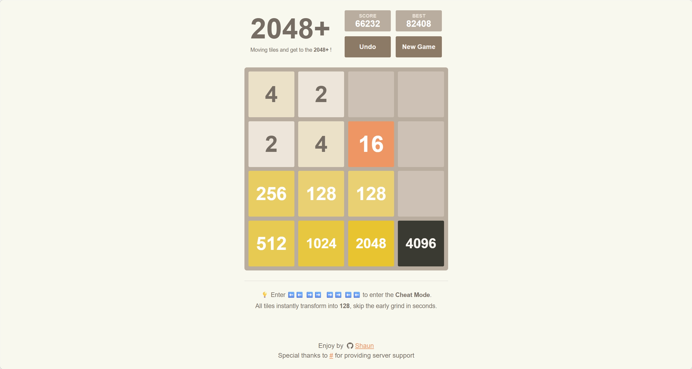

[English](README.md) | [简体中文](README.zh-CN.md) | [繁體中文](README.zh-TW.md)

<h1 align="center">2048--</h1>

<p align="center">
  <em>经典数字消除游戏 2048 的增强版本，加入了 回撤机制 与 快速模式 等有趣的功能！</em>
</p>

<p align="center">
  
  
  
  
</p>

## 🎮 Demo

👉 [试玩](http://2048.765431.xyz/)
<div align="center">
  
</div>


## ✨ 特色功能

### 1. 撤回功能
- 不小心走错了一步？别担心！
- 点击"撤回"按钮，立即回到上一步
- 支持连续撤回，直到游戏开始状态
- 再也不用因为手滑而懊恼了！

### 2. 快速模式
- 滑动特殊序列：⬅️⬅️ ➡️➡️  ➡️➡️ ⬅️⬅️（左左右右 右右左左）
- 激活后所有数字都会变成128
- 彩蛋功能，可快速跳过初期阶段，仅供娱乐


## 🚀 快速开始

### 方法一：云端运行(推荐)
```bash
git clone https://github.com/sz30/2048--.git
cd 2048--
pip install flask
python 2048--.py
```
打开浏览器并访问: [http://localhost:3000](http://localhost:3000)

### 方法二：使用 Docker 环境
*(具体的容器化部署策略，请参阅内置的 `DEPLOYMENT.md` 中文指南获取全文)*

### 方法三：本地运行调试
1. 下载最新的release版本
2. 确保安装了Python 3.x
3. 安装依赖：`pip install flask`
4. 运行：`python 2048--.py`
5. 打开浏览器并访问: [http://localhost:3000](http://localhost:3000)


## 📁 项目结构

```text
2048--/
├── assets/                   # 图像与媒体资源
├── static/
│   ├── css/
│   │   └── styles.css        # 游戏界面样式
│   └── js/
│       └── script.js         # 前端游戏逻辑
├── index.html                # 游戏主页面
├── 2048--.py                   # 后端服务器
├── requirements.txt          # Python 依赖文件
├── Dockerfile                # Docker 镜像配置文件
├── docker-compose.yml        # Docker compose 配置文件
└── DEPLOYMENT.md             # 部署指南
```

### 文件说明：
- `assets/`: 存放项目演示截图及媒体文件（如旧版界面 `demo_v1.png` 以及现版界面 `demo_v2.png`）
- `2048--.py`: 使用Flask框架编写的后端服务器，处理游戏逻辑和API请求
- `script.js`: 前端游戏逻辑，包含移动处理、动画效果和特殊功能实现
- `styles.css`: 游戏界面样式，确保游戏美观且响应式
- `index.html`: 游戏主页面，整合所有资源
- `requirements.txt`: 运行后端所需的Python依赖列表
- `Dockerfile`: 定义使用 Docker 运行小游戏的环境配置
- `docker-compose.yml`: 用于简化 Docker 部署和服务的管理
- `DEPLOYMENT.md`: 详细的项目部署指南


## 🎨 自定义

可通过修改`styles.css`来自定义游戏的外观，或者通过修改`script.js`来调整游戏的行为。所有的代码都有详细的注释，方便进行修改！


## 🤝 开源协议与协作共建

- 开源协议：[GPL-2.0](https://github.com/sz30/2048--/blob/main/LICENSE.txt)
- 本项目持续更新中，欢迎提交Issue和PRs。让我们一起把这个游戏变得更好玩！


## 🙏 致谢

感谢以下赞助者对本项目的支持：

- [/](#) 提供服务器


## ⭐ Star History

[](https://www.star-history.com/#sz30/2048--&type=date&legend=top-left)


---
*最后更新：2026年3月*